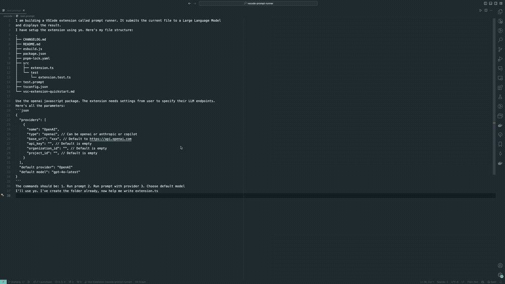

# Prompt Runner VSCode Extension

## Overview

Prompt Runner is a Visual Studio Code extension that allows users to run [prompt files](doc/prompt-file.md) against various LLMs directly from the editor. It turns VSCode into a powerful prompt IDE. You no longer have to tolerate the tiny chat interface or copy pasting between apps for complex prompts.

[The prompt file format](doc/prompt-file.md) is designed to help users define structured prompts for interacting with large language models (LLMs). It supports a variety of tools such as **input variable, web browsing, image, promtp chaining, code execution, control loop, etc.** to help users develop and evaluate prompts more efficiently. In fact, it has the potential to be a fully featured agent framework.

Check out the [this doc](doc/prompt-file.md) for a detailed documentation of what this extension supports. 



## Installation 

Install on [VSCode Marketplace](https://marketplace.visualstudio.com/items?itemName=JinShang.prompt-runner)


## Features

- **Run Prompt Files**: Run the content of the active editor as a prompt against the selected LLM provider and model. 
- **Extensive Tools**: [The prompt file format](doc/prompt-file.md) supports tools such as **input variable, web browsing, image, promtp chaining, code execution, control loop, etc.**. In fact you can build agents entirely with prompt files.
- **Multiple Providers** (Ongoing): Support for various providers including OpenAI, Ollama. I am working on Anthropic and VSCode Copilot as model providers.
- **Observability** (TODO): Integrate with prompt management platforms such as Langfuse for observability, feedback and prompt management.

## Usage

### Commands
Press `Ctrl+Shift+P` or `F1` to open the command palette, and type the following commands:
- **Compile Prompt File**: Compile the current prompt file.
  - Command: `Prompt Runner: Compile Prompt File`

- **Run Prompt File**: Run the current document as a prompt using the default provider and model.
  - Command: `Prompt Runner: Run Prompt File`
  
- **Run Prompt File with Selected Provider**: Run the current document as a prompt after selecting a provider and model.
  - Command: `Prompt Runner: Run Prompt File with Selected Provider`
  
- **Select Default Model**: Set the default provider and model to use for future prompts.
  - Command: `Prompt Runner: Select Default Model`

- **Select Output Location**: Set the output location of the compiled prompts or running outputs. Choose `webview panel` for better readability, or `output channel` for easier copy.
  - Command: `Prompt Runner: Select Output Location`

### Configuration

The extension allows users to configure providers and models in the VSCode settings. If no configuration is provided, the extension will initialize with default settings.

#### Default Providers

The default providers include:
- **OpenAI**: Supports models like `gpt-3.5-turbo`, `gpt-4`, etc.
- **Ollama**: A locally hosted LLM with support for custom models.
- **Anthropic** (TODO): Includes models such as `claude-3.5-sonnet`, `claude-3-opus`, etc.
- **VSCode Copilot** (TODO): Supports several versions of the GPT models provided by VSCode.

#### Provider Configuration Schema

The configuration for providers can be defined in the VSCode settings file. Currently supported provider types are `openai` and `ollama`. `anthropic` is coming next. Example config:

```json
{
    "prompt-runner.providers": [
        {
            "name": "openai",
            "type": "openai",
            "base_url": "https://api.openai.com/v1", // So that you can use OpenAI-compatible servers
            "api_key": "<your-api-key>",
            "models": [
                "gpt-3.5-turbo",
                "gpt-4",
                "gpt-4o",
                "gpt-4o-mini"
            ],
            "organization_id": "",
            "project_id": ""
        }
    ]
}
```

### Manual Compilation

1. Clone this repository or download the source code.
2. Install the necessary dependencies using `npm` or `yarn`:
   ```bash
   npm install
   ```
   or
   ```bash
   yarn install
   ```
3. Open the project in Visual Studio Code.
4. Press `F5` to launch the extension in a new VSCode window for testing and development.

## Debug

The logs of this extension are at the output channel. Select `Prompt Runner` in vscode output channel for debug logs.

## Development

TODO

## Contribution

Contributions are welcome! Please fork the repository, make your changes, and submit a pull request.

## License

This project is licensed under the MIT License.
